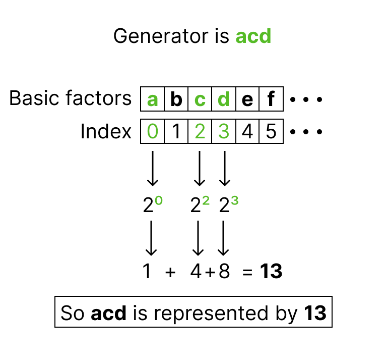

Regular designs
---------------

Columns as numbers
++++++++++++++++++

A two-level factor with `N` runs has :math:`k=log_2(N)` basic factors.
These factors specify all the treatment combinations of a :math:`2^k` full factorial design.
A full-factorial design for `k` factors can be generated using the :func:`fatld.main.basic_factor_matrix` function.

.. code-block:: python

    >>> ff_design = basic_factor_matrix(k=4)
    >>> ff_design.shape
    (16, 4)

Assuming that the factor levels are -1 and +1, additional factors are generated as products of the basic factors.
If we represent the basic factors with individual lowercase letters starting with `a`,
then a product of basic factors can be written by combining the letters of the basic factors.
Such products are called *generators*.
For example, a factor created as the product of the first, third and fourth basic factors would have `acd` as generator.

When a large number of basic factors is involved, the letter notation of the generators can be cumbersome.
The solution is to store them as numbers instead of words.
Since every number can be uniquely decomposed into powers of 2, each generator can be associated with a combination of powers of 2.
To do this, each basic factor is assigned to a specific power of 2.
For example, `a` is represented by 1, `b` by 2, and `c`  by 4.
The sum of these powers creates the number defining the generator.
The figure below show that process for the generator `acd` .

The function :func:`fatld.main.gen2num` can be used to generate the number corresponding to a generator.
Inversely, the function :func:`fatld.main.num2gen` can be used to generate the generator corresponding to a column number.

.. code-block:: python

    >>> gen2num('acd')
    13
    >>> num2gen(7)
    'abc'

Four-level factors
++++++++++++++++++

Four-level factors are constructed from pairs of two-level factors using the grouping scheme of Wu (1989).
In this scheme, the four levels of a factor `A` are created from the combination of the levels of two two-level factors `a` and `b`, as in the table below.
The two two-level factors and their interaction are called *pseudo-factors* and are represented as :math:`A_1=a`, :math:`A_2=b`, and :math:`A_3=ab`.

+----+----+----+
| `A`| `a`| `b`|
+====+====+====+
| 0  | 0  | 0  |
+----+----+----+
| 1  | 0  | 1  |
+----+----+----+
| 2  | 1  | 0  |
+----+----+----+
| 3  | 1  | 1  |
+----+----+----+

In this package, four-level factors are always created from pairs of basic factors.
Therefore, the pseudo-factors used to generate the four-level factors are always defined in the same way:

- `A` with factors `(a, b, ab)` or column numbers `(1, 2, 3)`
- `B` with factors `(c, d, cd)` or column numbers `(4, 8, 12)`
- `C` with factors `(e, f, ef)` or column numbers `(16, 32, 48)`

No more than three four-level factors are ever considered, and only designs with a runsize larger than 32 can have three four-level factors.

Constructing a design
+++++++++++++++++++++

When constructing a design with four-level factors and two-level factors, the four-level factors are always constructed from pairs of basic factors.
The two-level factors in the design include the remaining basic factors (if any) and the added factors.
The figure below details this process for a 64-run design with 2 four-level factors, 2 basic two-level factors and 5 added two-level factors.

.. image:: img/design_generation.png
  :width: 400
  :align: center

Only the column numbers of the added factors are given in the catalog.
But, as the figure shows, it is simple to reconstruct any design only from the added factors, given its run size.
